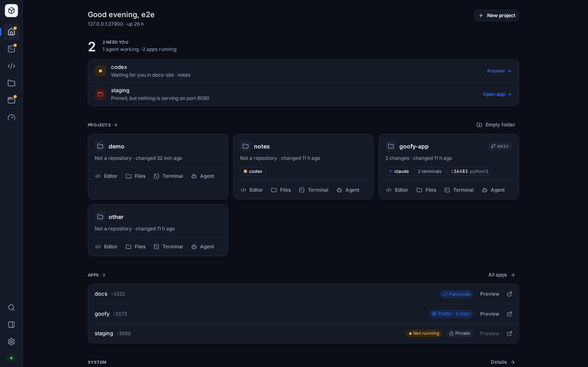
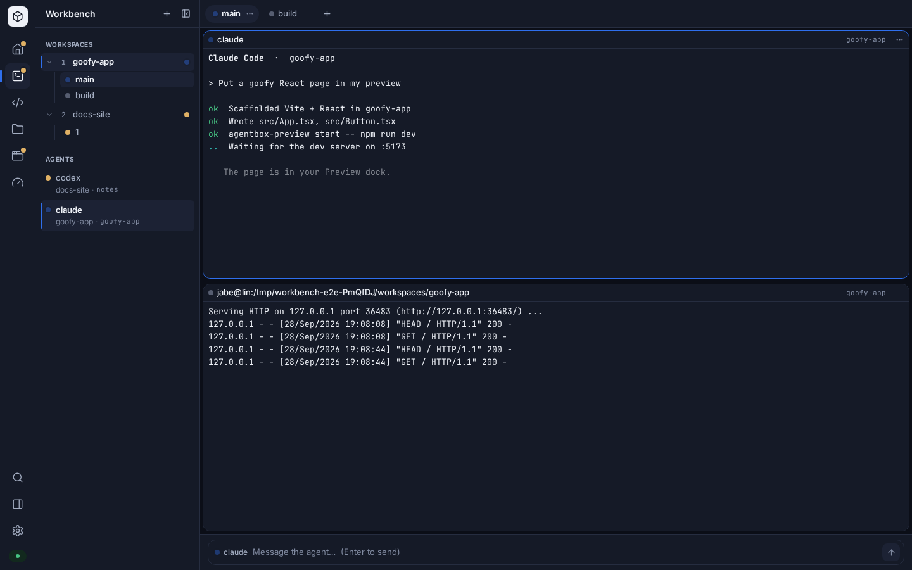

# agentbox

A sandboxed coding environment for a VPS, reachable from any browser.

One app for your coding agents and everything around them — a control room
for the agents, VS Code, a file manager, your dev servers with links you can
share, and the box's health — behind a real sign-in with optional two-factor,
in containers that cannot reach the host.

```bash
curl -fsSL https://raw.githubusercontent.com/jabezpauls/agentbox/main/install.sh \
  | bash -s -- --domain code.example.com
```

That installs Docker if it is missing, generates a password, obtains a TLS
certificate and starts the stack. It prints the password once.

## What you get

| Path | What it is |
| --- | --- |
| `/login` | The sign-in page; every other path sends you here first |
| `/` | The app: Home, and a rail to every other surface |
| `/workbench` | Many agents in live terminals across workspaces, with previews and review beside them. Old `/workbench/…` links redirect here |
| `/editor` | VS Code in the browser (code-server, at `/vscode/`), kept running while you use the rest |
| `/files/…` | A file manager for the workspace: drop folders to upload, download zips, a trash, quick look |
| `/apps` | Your dev servers, each with its own link, private until you share it |
| `/a/<id>/` | An app: a server an agent (or you) started, private until you share it — see [apps](docs/workbench.md#apps) |
| `/system` | CPU, memory, disks and processes; btop in full at `/system/monitor` |
| `/settings/…` | Password, two-factor, sessions, devices and the CLI, sharing, appearance |
| `/terminal` | herdr's TUI full-screen — the same session, keyboard-first |
| `/shell` | A plain bash shell, pleasant on a phone |

Sign-in is served by the **gate**, a small container outside the sandbox that
holds the password, sessions, optional two-factor (TOTP with recovery codes)
and device tokens, rate-limits and locks out guessing, and strips your
credentials from everything it passes on. See
[docs/install.md](docs/install.md#signing-in).

## The app

The whole thing is one app at the root of the box. A rail (a bottom bar on a
phone) moves between **Home** — what needs you, your projects, your apps and
how the box is doing — the **Workbench**, the **Editor**, **Files**, **Apps**,
**System** and **Settings**, and nothing reloads when you move: the editor
keeps its unsaved edits and the terminals their sessions. **Preview** and
**Review** live in a dock beside every surface, `⌘K` searches everything, and
every screen has an address you can reload or bookmark.



The Workbench is a browser client for [herdr](https://github.com/herdrdev/herdr),
the agent multiplexer in the image. It shows every agent across every
workspace at once, each in a live terminal, with the web apps they build
running in a Preview beside them — ask an agent to "put it in my preview" —
and the same `Ctrl+B` keymap the TUI uses. Each app has its own address on the
box, private until you share it. herdr owns the session, so closing the tab
detaches instead of killing, and `/terminal` is the same session seen from a
keyboard.



It is also where an agent shows you something rather than describing it: it
publishes an HTML page with `agentbox-review open plan.html`, you click the
part you mean and comment on it, and its blocked command returns with what you
said. No extra hostname and no extra container.

See [docs/workbench.md](docs/workbench.md) for every surface, the keyboard and
using it from a phone.

## From your laptop

The box serves its own command-line client. On any machine with Node.js 20+:

```bash
curl -fsSL https://code.example.com/cli/install | sh
```

That installs `agentbox` and signs it in through your browser — no password
in the terminal; the laptop gets a device token you can revoke. Then
`agentbox attach` puts herdr's TUI in your terminal, `agentbox shell` a bash,
`agentbox files put ./data -r` uploads a folder (resumably), `agentbox mount`
shows the workspace in Finder or your file manager, and `agentbox status` says
how the box is doing. See [docs/cli.md](docs/cli.md).

## Coding agents

[Claude Code](https://github.com/anthropics/claude-code) and
[Codex](https://github.com/openai/codex) are installed and on the `PATH`. Run
them from the editor's integrated terminal, from a pane in the Workbench (or
*Agent* on any project on Home, or any folder in Files), or full-screen in the
TUI at `/terminal`.

Set `ANTHROPIC_API_KEY` or `OPENAI_API_KEY` in `.env` to skip the interactive
login. Otherwise sign in once inside the sandbox; credentials persist in a
volume across restarts and updates.

Which agents are baked in is a build-time choice. The default is both; pick with
`--agents`:

```bash
./install.sh --agents claude          # just Claude Code
./install.sh --agents claude,codex    # the default
./install.sh --agents ''              # a plain environment, no agents
```

`herdr`, the multiplexer the Workbench and the TUI attach to, is always
installed. Adding another agent is a one-line entry in the manifest — the `case`
in `images/workspace/Dockerfile` mapping a name to its npm package — after which
that name is a valid `--agents` value.

## The sandbox boundary

This is the point of the project, so it is enforced rather than asserted:

- **No Docker socket.** Mounting it would make the container root on the host.
- **No host bind mounts in the sandbox.** `/workspace` is a named volume; `/`,
  `/home` and `/etc` are not visible. The proxy — a separate container, not the
  sandbox — mounts only its own configuration files, read-only.
- **No privileges.** Every process runs as UID 1000 with all capabilities
  dropped and `no-new-privileges` set.
- **Bounded.** CPU, memory and PID ceilings stop a runaway agent from taking
  the host down with it.
- **One door, outside.** Only the proxy publishes a port, and everything it
  receives goes through the gate — its own container, user and volume, which
  the sandbox cannot touch — before anything reaches the sandbox. No password,
  session cookie or token is ever passed on to it.

It protects the host from the sandbox. It does not make the code inside safe:
an agent with your keys can still push commits and spend tokens. See
[docs/security.md](docs/security.md) for the full threat model.

## Behind a Cloudflare Tunnel

If your server is already reachable through a Cloudflare Tunnel, use
behind-proxy mode and add a published application route pointing at the bind
address — no ports are opened and Cloudflare terminates TLS:

```
code.example.com  →  http://127.0.0.1:8443
```

Pass `--cloudflare on` to the installer so sign-in limits count each visitor
(read past Cloudflare's addresses) rather than the tunnel as one.

**Order matters.** `cloudflared` matches ingress rules top to bottom, so a
route placed below a wildcard such as `*.example.com` never runs. The symptom
is confusing: the hostname answers, but with whatever the wildcard points at,
so you get a `200` from the wrong service rather than an obvious error. Move
the specific hostname above the wildcard (row menu → **Move up**), and confirm
with the connector's own log, which prints the resolved ingress list.

## If ports 80 and 443 are taken

Common on a VPS that already runs something. Bind to loopback and let your
existing proxy front it:

```bash
curl -fsSL .../install.sh | bash -s -- --mode behind-proxy --bind 127.0.0.1:8443
```

For the strongest isolation, run it under
[rootless Docker](docs/install.md#rootless-docker) so the daemon itself is not
root.

## Running it

```bash
./scripts/agentbox status
./scripts/agentbox logs code
./scripts/agentbox shell            # a shell inside the sandbox
./scripts/agentbox workbench        # follow the Workbench bridge's log
./scripts/agentbox passwd           # change the password
./scripts/agentbox totp reset       # turn two-factor off (lost phone)
./scripts/agentbox backup           # archive workspace, home and the gate's store
./scripts/agentbox update           # pull, rebuild, restart
```

## Requirements

A Linux VPS with 2 GB RAM. Docker is installed for you if absent. A domain is
needed only for standalone mode's certificate.

Allow about 5 GB of disk: the image carries VS Code, Node, a Python toolchain
and a compiler, because agents routinely install dependencies that need them.
Build with fewer agents (`--agents`, above) or drop `build-essential` from the
Dockerfile if you want it smaller.

## Licence

MIT. See [LICENSE](LICENSE).
