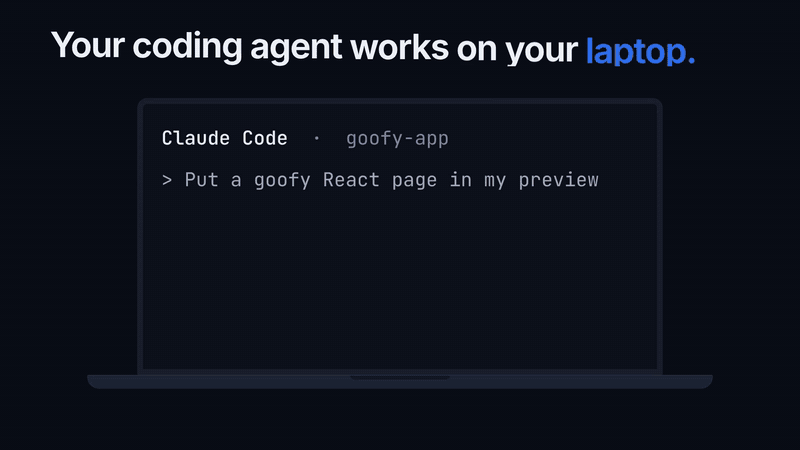
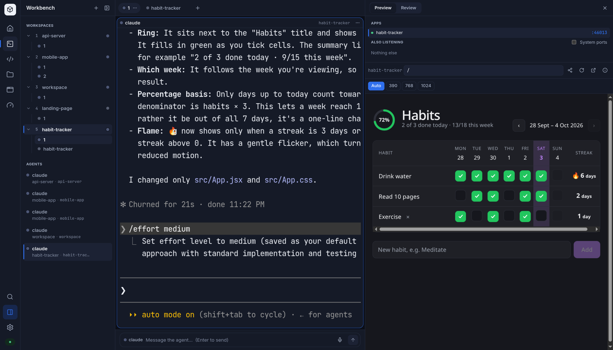
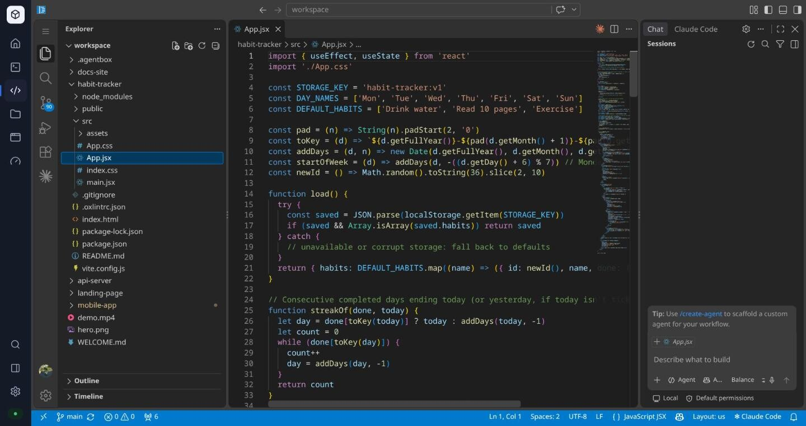
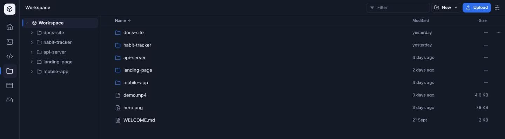
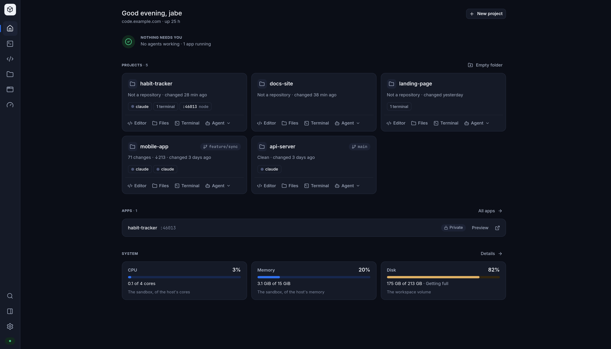

# agentbox

**A sandbox on your own server where coding agents keep working after you close the laptop.**

<p>
  <a href="docs/media/agentbox-flow.mp4">
    
  </a>
</p>

<p>
  <a href="#install">Install</a> ·
  <a href="#whats-in-the-box">What's in the box</a> ·
  <a href="#from-your-own-terminal">CLI</a> ·
  <a href="#security">Security</a> ·
  <a href="docs/how-i-use-it.md">How I use it</a> ·
  <a href="docs/install.md">Docs</a>
</p>

Agents that run on your laptop stop when you close the lid. agentbox moves
them to a VPS. You install it once, and from then on your agents keep working
around the clock while you check in from a browser, your phone, or your own
terminal.

It is one app at your own domain, and an orchestration layer for your agents.
Start as many as you like across your projects, see at a glance which are
working and which are waiting on you, and step into any of them. Run Claude
Code or Codex in live terminals,
watch the web app an agent is building open beside it, edit in VS Code, move
files around, and send someone a link to what got built. All of it runs in
unprivileged containers, behind a sign-in the agents cannot touch.

## Install

On a Linux VPS, with a DNS name pointed at it:

```bash
curl -fsSL https://github.com/jabezpauls/agentbox/releases/latest/download/install.sh -o install.sh
sudo bash install.sh --domain code.example.com
```

The script installs Docker if it is missing, downloads the latest release to
`/opt/agentbox`, pulls the prebuilt images, gets a TLS certificate and starts
everything. Nothing is cloned or compiled. It prints a password once. Open
`https://code.example.com`, sign in as `admin`, and start an agent in the
Workbench. Turn on two-factor in Settings → Account.

To update later:

```bash
cd /opt/agentbox && sudo ./scripts/agentbox update
```

It moves to the newest release and keeps your settings and files.

Something already on ports 80 and 443? Use `--mode behind-proxy` or
`--mode traefik`. Run the script with no options for a walk-through that asks
the same questions. Every option is in [docs/install.md](docs/install.md).

You need a Linux server (x86_64 or arm64) with 2 GB of RAM and about 5 GB of
disk. The image carries VS Code, Node, Python and a compiler, because agents
keep installing things that need them.

## What's in the box

### Workbench

This is where you run a team of agents. Every agent in every workspace, each
in a live terminal, all on one screen. Give one a feature, another the tests,
a third the docs, and move between them as they work.
The Workbench is a browser client for [herdr](https://github.com/herdrdev/herdr),
which owns the sessions. Closing the tab, losing Wi-Fi or switching to your
phone only detaches. Nothing stops.

When an agent is blocked on a question you get a toast, a count in the tab
title, and a row on Home. Scroll a pane's history with the mouse wheel. Over a
slow link, turn on the compose bar and type at local speed. The microphone
dictates into it.



Claude Code and Codex are installed. Any other terminal agent runs in a pane
the way it would anywhere else.

### Preview and sharing

Ask an agent to "put it in my preview". It runs
`agentbox-preview start -- npm run dev`, and the app opens beside its
terminal at a private address on your box, `/a/<id>/`. Live reload works.

When you want someone else to see it, press **Share**: anyone with the link,
or the link plus a passcode, for an hour, a day, a week, a month or until you
stop. Only you can share an app. An agent cannot, however it tries.

### Review

Some things are easier to point at than to describe. An agent writes an HTML
page and runs `agentbox-review open plan.html`. You click the heading or select
the sentence you mean and write a comment on it. The agent's command was
waiting the whole time, and returns with your comments attached to what they
point at.

### Editor

VS Code in the browser, on the same files your agents are working on, with
Claude Code's extension ready beside your code. It stays loaded while you move
around the app, so unsaved edits stay where you left them.



### Files

The workspace as a file manager. Drop whole folders to upload, download a
folder as a zip, look inside a file without opening it, and rename, move or
copy things around. Deleting goes to a trash, so nothing disappears by
accident. From your laptop, `agentbox files` and `agentbox mount` do the same.



### And the rest



- **Home.** Every project with its agents, terminals and apps, and what needs
  you right now.
- **Apps.** Every dev server in the box, whether it is up, and who can open it.
- **System.** CPU, memory, disks and processes, for the sandbox and the host.
  btop when you want more.
- **Settings.** Password, two-factor, sessions, devices, sharing, appearance.

It works on a phone, and `⌘K` searches everything. The full tour is in
[docs/workbench.md](docs/workbench.md).

## From your own terminal

Your box serves its own command-line client. On a machine with Node.js 20 or
newer:

```bash
curl -fsSL https://code.example.com/cli/install | sh
```

That installs `agentbox` and signs it in through your browser with a device
code. It is also on npm:

```bash
npm i -g @jabezpauls/agentbox
agentbox login https://code.example.com
```

Either way, the sign-in is the same. Your password never goes near the terminal, and the laptop gets a token
you can revoke. It also sets up SSH, so the box is a normal host:

```bash
agentbox attach                 # your agents in this terminal
ssh code                        # rsync, scp, VS Code Remote-SSH and Zed work too
agentbox files put ./data -r    # upload a folder; run it again to resume
agentbox mount                  # the workspace as a folder in Finder or your file manager
agentbox forward 5173           # a port in the box at localhost:5173 here
```

With herdr installed locally, `agentbox attach` runs `herdr --remote` over SSH:
your herdr draws the UI and the box sends only what the panes show. Without
it, the TUI is streamed from the box. See [docs/cli.md](docs/cli.md).

## Security

The agents run in the sandbox, so the sandbox is where things can go wrong. We
built the rest around that.

- **Sign-in lives outside the sandbox.** A small container, the gate, holds the
  password, sessions, two-factor and device tokens. Every request goes through
  it first. The sandbox can't read or change any of it.
- **No front-door credential enters the sandbox.** The gate strips your
  password, session cookie and tokens from everything it passes on.
- **No Docker socket, no host mounts, no root.** Sandbox processes run as UID
  1000 with every capability dropped, under CPU, memory and process limits.
- **Two-factor** (TOTP, with recovery codes), and rate limits with lockout on
  every password check.
- **A firewall for shared hosts.** `--isolate-host` installs nftables rules
  that stop the sandbox reaching the host and private networks. The public
  internet stays open, because agents need it.
- **Apps can't reach the box.** Everything under `/a/` runs in a sandboxed,
  opaque origin, so a page an agent wrote can't touch your session.

What it does not do is make the code inside safe. An agent with your API keys
can still push commits, spend tokens, and send anything in the workspace
anywhere on the internet. [docs/security.md](docs/security.md) has the full
threat model, including what a compromised sandbox can still do and how to
check the boundary yourself.

## Status and limits

agentbox is young and changes quickly. Releases are tagged, and
`sudo ./scripts/agentbox update` moves a box to the newest one.

- One user per box: one username and password, signed in from as many
  browsers and devices as you like.
- Outbound internet from the sandbox is open by default. Restricting it is
  up to you ([egress filtering](docs/security.md#egress-filtering)).
- Apps in the Preview get no service workers or IndexedDB, because they run
  in an opaque origin. `agentbox forward` gives you the real thing on
  `localhost`.
- Dictation uses the browser's own speech recognition. Chrome and Edge have
  it; Firefox does not.

Coming next: collaborative coding. Today a box belongs to one person; next it
becomes a place a team shares, with everyone's agents in one Workbench and
the people who started them working side by side.

## Running it

From the install folder, `/opt/agentbox`. If you installed as a normal user
in the `docker` group, it is `~/agentbox` and you can leave out `sudo`.

```bash
cd /opt/agentbox
sudo ./scripts/agentbox status
sudo ./scripts/agentbox logs code
sudo ./scripts/agentbox shell            # a shell inside the sandbox
sudo ./scripts/agentbox passwd           # change the password
sudo ./scripts/agentbox totp reset       # turn two-factor off (lost phone)
sudo ./scripts/agentbox backup           # archive workspace, home and the gate's store
sudo ./scripts/agentbox update           # the newest release: fetch, pull, restart
```

## Docs

- [Installing](docs/install.md): every option, behind-proxy and Traefik
  setups, Cloudflare, direct TLS, rootless Docker, updating
- [The app](docs/workbench.md): every surface, the keyboard, using it from a
  phone, apps and review
- [The CLI](docs/cli.md): attach, ssh, files, mount, forward
- [Security model](docs/security.md): the boundary and its residuals, stated
  plainly
- [How I use it](docs/how-i-use-it.md): a day with agentbox, from handing out
  work in the morning to reviewing it from a phone

## Where it comes from

We built agentbox as the agent sandbox for [Rubl](https://rubl.in), the
operating system we're making for small companies. This is that sandbox on
its own, open source, for anyone who wants their agents on their own server.

## Licence

MIT. See [LICENSE](LICENSE).
