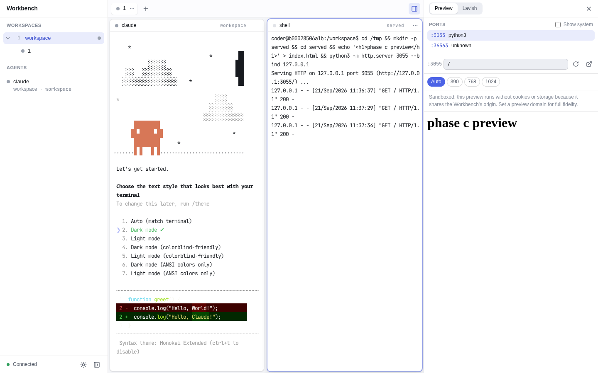

# The Workbench

The Workbench is a browser client for [herdr](https://github.com/herdrdev/herdr),
the agent multiplexer that runs inside the sandbox. It is served at
`/workbench`, behind the same login as everything else.

The editor at `/` is where you read and write code. The TUI at `/terminal` is
where you drive agents from a keyboard on a small screen. The Workbench is the
surface in between: several agents across several workspaces, all visible at
once, each in a live terminal, with the web apps they build previewable beside
them. herdr owns the session — the panes, the layouts, the agent processes —
so closing the tab detaches rather than kills, and the TUI and the Workbench
are two views of one session rather than two sessions.



Everything it shows comes from herdr over a local socket. The bridge that
serves the app holds one connection to herdr and fans its events out to every
open tab, so two browsers, a phone and the TUI all stay in step. Nothing is
stored in the browser except your theme and the inspector's width.


## The layout

- **Sidebar** — workspaces, their tabs, and a flat list of every agent with its
  status. A workspace rolls up the worst status inside it, so a blocked agent
  is visible without expanding anything. `prefix+b` hides it.
- **Tab bar** — the tabs of the focused workspace. Rename in place with `F2`,
  close with `Delete`, walk them with the arrow keys.
- **Pane grid** — herdr's layout, rendered as live terminals. Drag a split to
  resize it; the new ratio is sent to herdr, which is authoritative, so every
  other viewer follows.
- **Composer** — appears under the grid when the focused pane holds an agent.
  `⌘/Ctrl+Enter` sends; `Escape` puts focus back in the terminal.
- **Inspector** — a drawer on the right with two panels: **Preview** for the
  ports something is listening on, and **Lavish** for review sessions.

## Working with agents

Create a workspace from the palette (`⌘/Ctrl+K` → *New workspace*) or with
`prefix+⇧N`. The picker is confined to `/workspace`; tick *Create a git
worktree* to branch an existing repository into a workspace of its own, which
is the usual way to put two agents on the same codebase without them fighting
over the index.

Then run an agent in a pane like you would anywhere else:

```bash
claude          # or codex
```

herdr notices the agent and the Workbench starts tracking it: its status
appears beside the pane title, in the tab, in the workspace rollup and in the
agent list. When an agent blocks on a question in a pane you are not looking
at, a toast appears and the document title picks up a count, so a background
tab still tells you. *Next blocked agent* in the palette jumps to the one
waiting longest.

Closing a pane, a tab or a workspace that still has a working agent asks first.

## Keyboard

The prefix is `Ctrl+B`, as in herdr's TUI and tmux. Press it, see the HUD pill,
then press the binding. It works inside a terminal and outside one; only a text
field takes precedence.

| Keys | Action |
| --- | --- |
| `⌘/Ctrl+K` | command palette |
| `prefix+c` | new tab |
| `prefix+v` / `prefix+-` | split right / split down |
| `prefix+h` `j` `k` `l` | focus the pane left / down / up / right |
| `prefix+⇧H` `⇧J` `⇧K` `⇧L` | swap the pane in that direction |
| `prefix+z` | zoom the focused pane |
| `prefix+x` / `prefix+⇧X` | close pane / close tab |
| `prefix+n` / `prefix+p` / `prefix+1…9` | next / previous / nth tab |
| `prefix+⇧N` / `prefix+⇧W` / `prefix+⇧D` | workspace: new / rename / close |
| `prefix+w` / `prefix+g` | palette, filtered to workspaces / everything |
| `prefix+b` | toggle the sidebar |
| `prefix+q` | blur the terminal (the browser's equivalent of detach) |
| `prefix+Ctrl+B` | send a literal `Ctrl+B` to the program in the pane |
| `prefix+?` | show this keymap |

## Previews

The bridge watches which TCP ports are listening inside the sandbox and lists
them in the Preview panel, hiding agentbox's own services behind a toggle. Pick
one and it loads in the drawer, with device widths and an editable path.

There are two ways to reach it, and the difference matters.

**Path previews** are always available. The bridge proxies
`/workbench/preview/<port>/…` to `127.0.0.1:<port>` inside the sandbox. Because
that is the Workbench's own origin, the iframe is sandboxed *without*
`allow-same-origin`: an agent-written dev server must not be able to script the
Workbench, read its storage or call its API as you. The cost is that the
previewed page has no cookies, no `localStorage` and no same-origin requests of
its own. For most dev servers that is invisible. Apps that build absolute URLs
from the origin, or that are mounted at the root, may also need to be told they
are behind a prefix — Vite's `base`, Next's `basePath`, JupyterLab's
`--ServerApp.base_url`, and similar.

**Hostname previews** give each port an origin of its own,
`PORT.<preview-domain>`, and therefore full fidelity with no sandbox. Turn them
on by setting a preview domain:

```bash
./install.sh --domain code.example.com --preview-domain preview.example.com
```

That needs a wildcard DNS record, `*.preview.example.com`, pointing at the same
host. In standalone mode Caddy issues each certificate on demand the first time
a hostname is requested, gated so it only ever answers for numeric subdomains
of your preview domain; no DNS-provider plugin is needed. Behind an existing
proxy, that proxy needs the wildcard certificate and should forward those
hostnames to the same address as the main one.

> **Cloudflare Tunnel:** Universal SSL covers a single wildcard level, so
> `*.example.com` is certified and `*.preview.code.example.com` is not. Put the
> preview domain one label below the zone apex — `preview.example.com`, whose
> wildcard `*.preview.example.com` is *two* levels and therefore not covered
> either. In practice this means either buying Advanced Certificate Manager, or
> using the apex wildcard itself (`3000.example.com`) as the preview domain.
> Path previews need none of this and are the right default for a tunnel.

Full-screen (the ↗ button) opens the preview domain when one is configured and
the path proxy otherwise.

## Lavish

[lavish-axi](https://www.npmjs.com/package/lavish-axi) renders HTML an agent
has written so you can look at it and comment. It runs as its own service in
the sandbox and the Lavish panel lists its sessions.

lavish cannot be served under a path prefix, so it gets a hostname:
`lavish.<your domain>` by default, or `--lavish-domain` at install time. The
installer writes both `AGENTBOX_LAVISH_DOMAIN` (which lavish uses to allow the
`Host` header and to build links) and `AGENTBOX_LAVISH_URL` (which the
Workbench links to).

An agent opens a session from inside the sandbox:

```bash
lavish-axi open report.html
```

The session then appears in the panel. Selecting one shows it inline where the
browser allows it; because it is a different origin from the Workbench, some
sessions refuse to be framed and the panel offers to open them in a tab
instead. That is a limitation of cross-origin framing, not of the setup — the
hostname is what makes lavish work at all.

The panel shows a setup card with the exact environment variables when lavish
is not configured.

## firstmate

[firstmate](https://github.com/herdrdev/firstmate) drives a fleet of agents
across git worktrees. It fits a workspace well:

```bash
cd /workspace
git clone https://github.com/you/your-project
cd your-project
gh auth login            # gh is in the image; firstmate uses it for PRs
firstmate                # or: firstmate --backend herdr
```

With the tmux backend it manages its own session inside the pane. With the
herdr backend its panes become herdr panes, which means they show up as
workspaces and agents in the Workbench like anything else. Either way, create
the workspace as a **git worktree** first if you want the Workbench's own
worktree bookkeeping rather than firstmate's.

## Troubleshooting

**The connection pill says disconnected.** The bridge could not reach herdr.
`./scripts/agentbox workbench` shows its log; it starts a herdr server itself
if none is answering and retries with backoff, so this usually clears on its
own. If it does not, `./scripts/agentbox shell` and run `herdr` to see whether
the server is healthy.

**A terminal shows "Disconnected".** The websocket dropped — a restarted
bridge, a tunnel blip. It retries with backoff and repaints from herdr's own
buffer when it returns, so nothing is lost. After several failures it stops and
offers a Reconnect button.

**A pane is blank.** The pane exists but the program in it has drawn nothing
yet. Click it and press a key.

**The port is not listed.** The Workbench only lists ports bound inside the
sandbox. A server bound to `127.0.0.1` is fine — that is the common case — but
one started on the host is invisible, by design. Ports belonging to agentbox's
own services are hidden behind *Show system*.

**The browser asks for the password again.** Basic authentication is per
origin, so `lavish.<domain>` and each `PORT.<preview-domain>` prompt
separately. The credentials are the same.

**Cloudflare Access in front of the tunnel.** Access intercepts the websocket
upgrade for anything without a session, so the Workbench's event stream and its
terminals will not connect from an unauthenticated context. Add a service-token
or bypass policy for the hostname, or use agentbox's own login alone.
