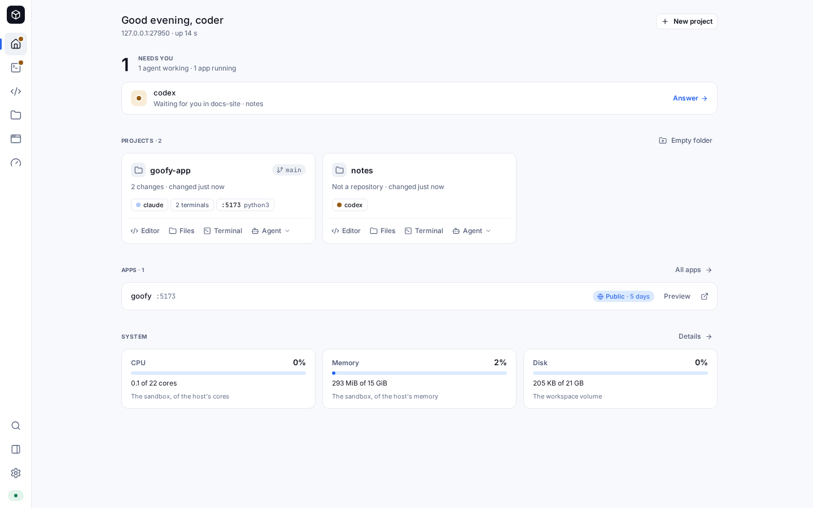
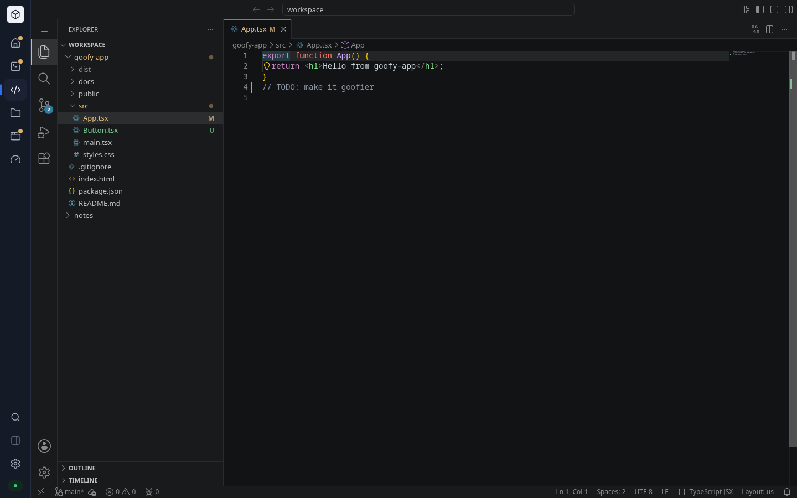
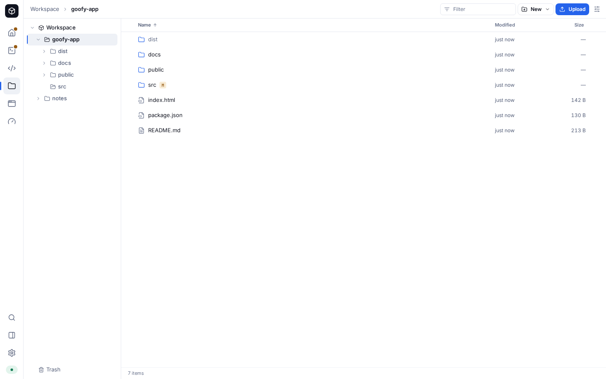
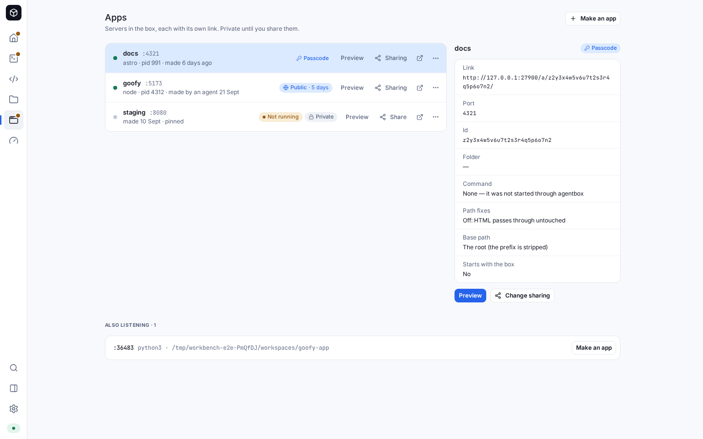
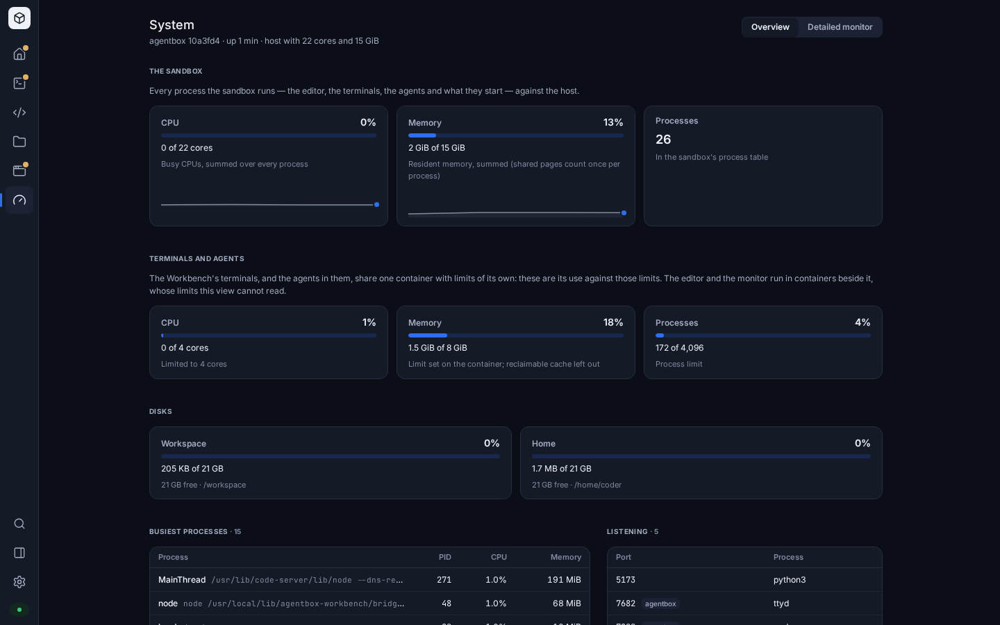
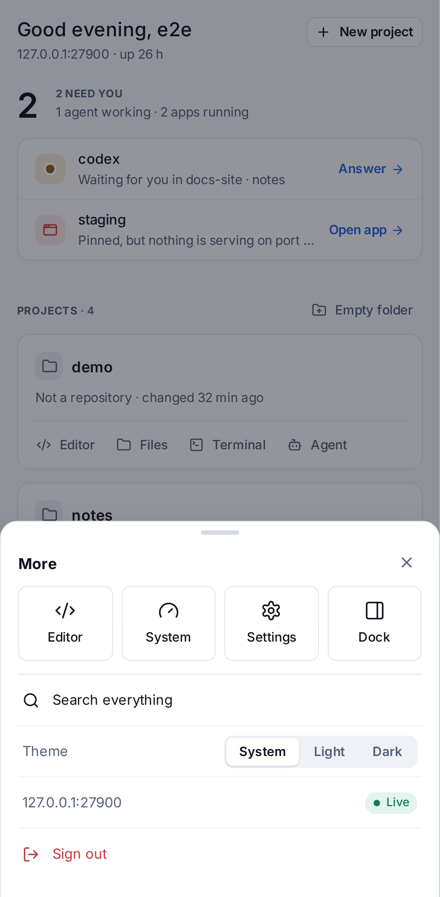

# The app

agentbox is one app, served at the root of your box behind the same sign-in as
everything else. A rail on the left — a bottom bar on a phone — moves between
its surfaces:

| Surface | Route | What it is for |
| --- | --- | --- |
| **Home** | `/` | what needs you, your projects, your apps and how the box is doing |
| **Workbench** | `/workbench` | every agent in a live terminal, across workspaces and tabs |
| **Editor** | `/editor` | VS Code (code-server), kept running while you use the rest |
| **Files** | `/files/<path>` | the workspace as a file manager: upload, download, trash, quick look |
| **Apps** | `/apps`, `/apps/<id>` | the dev servers in the box, their links and who can open them |
| **System** | `/system`, `/system/monitor` | CPU, memory, disks, processes, versions; btop in full |
| **Settings** | `/settings/<section>` | account and two-factor, devices and the CLI, sharing, appearance |



Every route is a real address: reload, bookmark, send it to yourself, press
back. Files takes the absolute path — `/files/workspace/proj/src` is
`/workspace/proj/src`, and a link to a file opens it in quick look over its
folder — the same shape `agentbox open <path>` uses from a laptop. Links from
before the app moved to the root — `/workbench/…`, including old review links —
redirect to `/workbench`.

**Nothing reloads when you move.** A surface is built the first time you visit
it and kept after: the editor's frame is never recreated (unsaved text stays
unsaved, not lost), the Workbench's terminals keep their sockets, a preview
keeps running. A surface you are not looking at stops polling — System reads
the box every two seconds only while it is showing — but keeps its sockets.

**The dock** on the right holds **Preview** and **Review** on every surface.
`⌃⌥D` (Ctrl+Alt+D) or the rail's dock button opens and closes it; drag its edge
to resize it. Whether it is open and how wide it is are remembered per surface —
open beside the terminals, closed over Files, say. On a phone it is a
full-screen sheet.

**The palette**, `⌘K` / `Ctrl+K` (or `⌃⌥K` from anywhere, the editor
included), searches everything: the surfaces, projects, files by name (asked of
the box as you type), agents, apps, open reviews, the Workbench's workspaces,
tabs and panes, and every command — theme, settings, the trash, the monitor,
sign out. Type a port number to preview it, or a path to open it in Files.

Nothing is stored in the browser but conveniences: the theme, the dock's shape
per surface, the Workbench sidebar's width, Files' sort and view options, the
default share expiry, which finished agents you have already looked at. What
matters — sessions, apps, sharing — lives in the gate and the box.

## Home

What needs you comes first, with the count as the page's one big number: an
agent blocked on a question, a review waiting for your comments, a pinned app
that should be running and is not, an agent that finished and you have not
looked at since. Each row is one step from the thing itself — the pane, the
review in the dock, the app. A finished agent leaves the list once you focus
its pane, or when you dismiss it.

**Projects** are the workspace's top-level folders, each a card with its git
branch, uncommitted changes, ahead and behind, when it last changed, the agents
working in it and the servers it runs. From a card: **Editor**, **Files**,
**Terminal** (a tab in the project's own workspace, or a new workspace named
after the project) and **Agent** (the same, with Claude Code, Codex or another
agent the box has started in it). **New project** clones a Git repository —
its card shows git's progress and can stop it — or makes an empty folder.

Below: your **apps** with whether they are running and who can open them, and
a **system** strip — the sandbox's CPU and memory against the host's, and the
workspace disk.

## The Workbench


The Workbench is a browser client for [herdr](https://github.com/herdrdev/herdr),
the agent multiplexer that runs inside the sandbox: several agents across
several workspaces, all visible at once, each in a live terminal. herdr owns
the session — the panes, the layouts, the agent processes — so closing the tab
detaches rather than kills, and the TUI at `/terminal` and the Workbench are
two views of one session rather than two sessions.

Everything it shows comes from herdr over a local socket. The bridge that
serves the app holds one connection to herdr and fans its events out to every
open tab, so two browsers, a phone and the TUI all stay in step.

- **Sidebar** — workspaces, their tabs, and a flat list of every agent with its
  status. A workspace rolls up the worst status inside it, so a blocked agent
  is visible without expanding anything. `prefix+b` or `⌘B` hides it, and the
  edge between it and the grid can be dragged to resize it. On a narrow screen
  it is a sheet over the terminals.
- **Tab bar** — the tabs of the focused workspace. Rename in place with `F2`,
  close with `Delete`, walk them with the arrow keys.
- **Pane grid** — herdr's layout, rendered as live terminals. Drag a split to
  resize it; the new ratio is sent to herdr, which is authoritative, so every
  other viewer follows.
- **Composer** — appears under the grid when the focused pane holds an agent.
  `Enter` sends, `Shift+Enter` starts a new line, and `Escape` puts focus back
  in the terminal.

### Working with agents

Create a workspace from the palette (*New workspace*), with the sidebar's `+`,
or with `prefix+⇧N`. The picker is confined to `/workspace`; tick *Create a git
worktree* to branch an existing repository into a workspace of its own, which
is the usual way to put two agents on the same codebase without them fighting
over the index. Home's and Files' *Terminal* and *Agent* buttons open a tab in
the right place for you.

Then run an agent in a pane like you would anywhere else:

```bash
claude          # or codex
```

herdr notices the agent and the app starts tracking it: its status appears
beside the pane title, in the tab, in the workspace rollup, in the agent list,
on Home and as a dot on the rail. When an agent blocks on a question in a pane
you are not looking at, a toast appears and the document title picks up a
count, so a background tab still tells you. *Next blocked agent* in the palette
jumps to the one waiting longest.

Closing a pane, a tab or a workspace that still has a working agent asks first.

## The editor



`/editor` frames VS Code (code-server, served by the gate at `/vscode/`). The
frame is built the first time you open the editor and never rebuilt, so VS Code
keeps its state — open files, unsaved edits, its own terminals — while you use
the rest of the app. **Open in editor**, from a file in Files, a project on
Home, an app or the palette, brings the editor forward (starting it if it has
not been opened yet) and asks it to open the file, at a line when there is one:
the **agentbox connect** extension baked into the image holds a socket to the
bridge and opens what it is sent, and the bridge waits for it while a cold
editor starts.

Inside the editor VS Code owns the keyboard, `⌘K` included. The app's `⌃⌥`
chords still work there — the app listens on the editor's frame, which is on
the same origin — and VS Code binds none of them by default.

## Files



Files is the workspace as a file manager would show it: a folder tree beside a
list, breadcrumbs, sort by name, size or date, a filter, and git status marks
(`M` modified, `A` added, `U` untracked, `D` deleted, `R` renamed, `C`
conflicted). Hidden files and the home folder (`/home/coder`) are one switch
away under the view options.

- **Upload** by dropping files or whole folders anywhere on the list (or on a
  folder, to put them there), or with *Upload*. Uploads go up in chunks and
  keep going while you use the rest of the app; a dropped connection resumes
  where the server says it got to. A name that is already taken asks, once for
  all of them: *Replace* (the old one goes to the trash), *Keep both* (`name
  (2).ext`) or *Skip*.
- **Download** a file as itself, a folder or several things as a zip.
- **Rename** in place with `F2`. **Drag** rows onto a folder, the tree or a
  breadcrumb to move them; hold `Alt` or `Ctrl` to copy.
- **Delete** sends to the trash, with an *Undo* in the toast. The **Trash**
  (`/files?trash=1`) restores things to where they were, or deletes them for
  good; nothing else deletes outright.
- **Quick look** (`Space`, or a click on a file) shows text and code, rendered
  Markdown, pictures and PDFs over the list; `←` and `→` walk the folder. HTML
  and SVG show as their source, never as a live page, and rendered Markdown is
  sanitised.
- From any file or folder: **Open in editor**, **Terminal here**, **Claude
  Code here** (or another agent), **Copy path**, **Download**, **Duplicate**,
  and for a folder **Serve as an app**.

The list is drawn a screenful at a time, so a folder of thousands is as light
as one of ten; a very large folder pages in as you scroll and sorts by name
only, the order the box reads it in.

## Apps



Every app the box knows: its name and port, whether something is answering on
it (and which process, in which pane), who made it and when, and who can open
it until when. **Preview** puts it in the dock; the arrow opens its own link;
**Share** chooses private, anyone with the link, or link and passcode, and for
how long — and copies the link as soon as it is public. A menu per app
restarts, stops, renames, pins it to start with the box, turns the path fixes
off or on, and deletes it. Ports that are listening but are not apps yet are
listed below, one click from being one. Settings → Sharing lists everything
that is public in one place.

## System



How the box is doing, in two honest views. **The sandbox** is every process
the sandbox runs — the editor, the terminals, the agents and what they start,
across its containers — summed from `/proc`, against the host's cores and
memory. **Terminals and agents** is the one container they share — the
Workbench's terminals and the agents in them — against its own CPU, memory and
process limits; the editor and the monitor run in containers beside it, whose
limits the bridge cannot read.
Then the disks, the busiest processes, what is listening, versions and uptime.
**Detailed monitor** (`/system/monitor`) is btop, full size; it is loaded
only while you look at it, since btop streams a frame a second whether seen
or not.

## Settings

- **Account** — the password, two-factor sign-in (a QR code to scan, then ten
  recovery codes to copy or download), and every session with its browser,
  address and when it was last seen; end one, or all but this one.
- **Devices & CLI** — the one-line install for the `agentbox` command on a
  laptop (`curl -fsSL https://<box>/cli/install | sh`), a box for the code it
  shows when it signs in (approval happens on the gate's own page,
  `/settings/devices?code=`, outside the sandbox), and the devices that hold a
  token, each of which you can revoke.
- **Sharing** — how long a new share lasts, and every public app.
- **Appearance** — light, dark, or follow the system.
- **About** — versions, and the keyboard shortcuts.

Anything that could hand the box to someone else or lock you out — a new
password, two-factor on or off, revoking a device — asks for your password
(and a code, with two-factor on) in the moment, and it is sent with that one
request only.

## On a phone



At 700 px and narrower the rail becomes a bottom bar — Home, Workbench, Files,
Apps and **More**, which holds the editor, System, Settings, the dock, search,
the theme and sign-out. The dock, quick look and the palette fill the screen;
the Workbench's sidebar is a sheet; a tap opens a folder or looks at a file;
rows carry a checkbox for choosing several. The first dev server to start does
not open the dock on its own there — it would take the whole screen.

## Keyboard

The app's own keys were chosen to collide with neither the browser nor VS
Code's default keymap, because they must work inside the editor too. `⌃⌥` is
Control+Option on a Mac and Ctrl+Alt elsewhere; where Ctrl+Alt is AltGr and
types a character (AltGr+7 is `{` on a German keyboard), the character wins.
`?` shows every shortcut.

| Keys | Action |
| --- | --- |
| `⌘K` / `Ctrl+K` | the palette (not in the editor, where it is VS Code's; `Ctrl+K` not in a text field or terminal, where it deletes to the end of the line) |
| `⌃⌥K` | the palette, from anywhere |
| `⌃⌥1` … `⌃⌥6` | Home, Workbench, Editor, Files, Apps, System |
| `⌃⌥,` | Settings |
| `⌃⌥D` | open or close the dock |
| `?` or `⌃⌥/` | the keymap sheet |
| `g` then `h` `w` `e` `f` `a` `s` `,` | go to a surface, wherever nothing is being typed |

Where they collide: on a Mac with VoiceOver on, `⌃⌥` is VoiceOver's own
modifier and VoiceOver takes those keys first — use `⌘K`, the rail and the
`g` sequences. In Emacs in a terminal, `⌃⌥K` and `⌃⌥D` are also `C-M-k` and
`C-M-d`, and the app takes them first; `Esc` then `C-k` (or `C-d`) is the
same command to Emacs.

In Files: `↑` `↓` move (with `⇧`, select), `↵` opens, `Space` quick look,
`⌫` or `⌘↑` goes up, `F2` renames, `Delete` or `⌘⌫` moves to the trash, `⌘A`
selects everything, typing jumps to a name.

In the Workbench the prefix is `Ctrl+B`, as in herdr's TUI and tmux. Press it,
see the HUD pill, then press the binding. It works inside a terminal and
outside one while the Workbench is showing; only a text field takes
precedence.

| Keys | Action |
| --- | --- |
| `prefix+c` | new tab |
| `prefix+v` / `prefix+-` | split right / split down |
| `prefix+h` `j` `k` `l` | focus the pane left / down / up / right |
| `prefix+⇧H` `⇧J` `⇧K` `⇧L` | swap the pane in that direction |
| `prefix+z` | zoom the focused pane |
| `prefix+x` / `prefix+⇧X` | close pane / close tab |
| `prefix+n` / `prefix+p` / `prefix+1…9` | next / previous / nth tab |
| `prefix+⇧N` / `prefix+⇧W` / `prefix+⇧D` | workspace: new / rename / close |
| `prefix+w` / `prefix+g` | palette, filtered to workspaces / everything |
| `prefix+b` or `⌘B` | toggle the sidebar |
| `prefix+q` | blur the terminal (the browser's equivalent of detach) |
| `prefix+Ctrl+B` | send a literal `Ctrl+B` to the program in the pane |
| `prefix+?` | show the keymap |

## Apps

An **app** is a server running in the sandbox — a dev server, usually — with
one address on your box: `/a/<id>/`, where the id is 26 random characters. The
**Preview** panel shows your apps; the same address opens full screen in a tab
of its own, and it is the address you share.

### Putting an app in Preview

Agents do it for you: ask one to "put it in my preview", and it runs

```bash
agentbox-preview start -- npm run dev
```

which registers the app, runs the dev server in a terminal tab beside the
agent (so you can watch it and stop it), waits until it answers, and switches
the Preview panel of every tab you have open to it, with a note saying who
opened it. Editing a file updates the page (live reload works). Agents are
told about this every time they start, and never to show you a web app any
other way. From a pane of your own the same command works, and:

```bash
agentbox-preview open 3000                # a server that is already running
agentbox-preview static ./dist            # a folder, served for you
agentbox-preview list                     # every app, serving or not
agentbox-preview stop <id>                # stop its server, remove the app
agentbox-preview start --pin -- npm run preview   # restarted whenever the box starts
```

The command runs with `PORT`, `HOST=127.0.0.1` and `AGENTBOX_BASE_PATH` set;
for Vite, `agentbox-preview` adds `--base /a/<id>/ --port <p> --strictPort
--host 127.0.0.1` itself. A server you start some other way shows up in the
panel under **Also listening**; choosing it makes it an app. A `localhost`
link printed in a terminal does the same. Exit codes: 0 ready, 1 error, 5 the
server never answered (its last output is printed).

A **pinned** app with a command is started again, in a tab of an **Apps**
workspace, whenever the box starts; with a link that does not expire, that is
a staging site.

### The panel

A picker of your apps (with a light for "serving") and of what else is
listening; a path bar within the app; reload; full screen; phone, tablet and
desktop widths; **Share**; and an info popover with the path-fixes switch and
the command that opens the app on your own machine (`agentbox forward
<port>`). Before it shows an app the panel checks it, so a server that is not
up yet is a calm "nothing is serving on port N yet", with Retry (and Start,
for an app with a command). If a page load does reach a port where nothing is
answering, the box returns its own page with Retry rather than a raw 502; a
script's request gets a `502` it can handle, and anything the app itself
sends, error statuses included, comes through untouched.

### Every app is sandboxed

Every app runs with an **opaque origin**: the box serves every `/a/` response
under a `sandbox` Content-Security-Policy, and the panel's frame carries the
same sandbox. So the page an agent wrote cannot touch the box — its cookies,
storage, API or terminals — whether it is in the panel or open full screen,
and what you see in the panel is exactly what someone you share it with sees.

That costs an app a few things, which the panel's info popover lists too:

- no service workers and no IndexedDB;
- `localStorage`, `sessionStorage` and cookies set from script work, but are
  kept in memory and reset on reload;
- an app that writes its own absolute address (`http://localhost:5173/…`)
  into its pages will not find itself.

Cookies the app's server sets work: the box keeps them to the app's own path,
so an app with its own sign-in works in the panel and when shared. For
anything that needs full fidelity — service workers, a real origin — run
`agentbox forward <port>` on your own machine (see [the CLI](cli.md)) and open
`http://localhost:<port>`.

### Apps written for `/`

A dev server started plainly, like `npm run dev`, believes it runs at the root
of `localhost`: it writes `/src/main.tsx` and `/@vite/client` into its pages
and opens its live-reload socket at `/`. The box fixes that on the way
through — **path fixes**, on by default for every app:

1. in HTML, root paths in `src`, `href`, `action`, `formaction`, `poster` and
   `srcset` are put under `/a/<id>/`, and module scripts are loaded with
   credentials, so they carry the app's access;
2. an import map sends root-absolute module imports (`import "/@vite/client"`)
   under the app;
3. a small script, first in every page, does the same for what the page does
   at runtime — `fetch`, `XMLHttpRequest`, `WebSocket`, `EventSource`,
   workers, history, and URLs set on elements — and gives the page in-memory
   storage where its opaque origin has none;
4. in CSS, `url(/…)` is put under the app.

Pages are requested uncompressed for this and nothing else is touched:
scripts, images and streams pass through as the app sent them. If a page
still names something the box could not reach — it brings its own import map,
or has an absolute `localhost` address written in — the panel says "This app
assumes it runs at `/`" with the base path to copy. Starting the app with its
base path set is always the surer way; the `preview` skill has the recipe for
Vite, Next, Astro, SvelteKit and Create React App. Turn the fixes off (the
info popover's **Path fixes**) for an app that already runs under its base
path.

### Sharing an app

Only you can share an app — agents cannot, whatever they try. Press **Share**,
choose **anyone with the link** or **link and a passcode**, and for how long
(an hour, a day, a week, a month, or until you stop), and the app's address is
copied: the same address you were looking at, now open to whoever has it. A
shared app keeps a banner in the panel while it is shared. A passcode is at
least 8 characters; the dice button makes one (or leave it empty and the box
makes one), and the copy button copies it to hand on. A visitor with the
passcode page sees your app's name and a passcode field, nothing else.

While you have a private app open, a site that knows its address can reach it
as you; keep private app addresses to yourself and sign out when you are done
(see [the security model](security.md#apps)).

**Stop sharing** makes the app private again at once, and cuts off anyone
still connected — their page, its streams and its live-reload socket. A link
that expires does the same within 30 seconds (and opens for nobody from the
moment it expires). A new passcode shuts out everyone who used the old one.

The operator can turn sharing off for the whole box (`install.sh --sharing
off`, or `./scripts/agentbox update --sharing off`): the Share button goes, and
anything shared is private again.

agentbox's own services are never apps: the editor, the terminals and the
bridge (ports 8080, 7681–7683, 7800, 7801) and the box's front door (7900,
7901) are refused, whoever asks.

### What proves it

`npm run fidelity -w app` runs the fidelity suite: the real gate and bridge
behind TLS, with a checked-in create-vite React-TS app started both by
`agentbox-preview` and plainly with `npm run dev`, and two small apps (browser
storage; a cookie sign-in with a live event stream), in Chromium, Firefox and
WebKit. Each app must render in the panel and full screen, load its images,
reload live with its state kept, work shared with a visitor who is not signed
in, and cut that visitor off when sharing stops; the passcode page and an
expiring link are checked too. Install the fixture's dependencies once with
`npm run fidelity:deps -w app` (they are kept). On a host without Firefox's or
WebKit's system libraries, `web/app/fidelity/in-docker.sh` runs the suite in
the official Playwright image that matches the repository's
`@playwright/test`.

## Review

Some of what an agent has to say is a place in a document rather than a
paragraph: a plan you want reordered, a table with one wrong row, a diagram
missing an arrow. Review is that conversation. The agent writes an HTML file
and publishes it; you see it in the dock, click the heading or select the
phrase you mean, say what you think, and send. The agent's command was blocked
all along and returns with your comments attached to what they refer to.

From inside the sandbox:

```bash
agentbox-review open plan.html --label "Rollout plan"
agentbox-review poll plan.html          # blocks until you press Send
```

`open` prints a link — `<your box>/workbench?review=<key>` — and the session
appears in the **Review** panel of the dock. The CLI talks to the bridge
at `http://127.0.0.1:7800` inside the sandbox (`AGENTBOX_REVIEW_URL` overrides
it). Choose it and the page renders there, beside the terminals — no
second hostname and no second login, which is what the old lavish-axi service
could never offer.

Press **Annotate**, then click an element or select some text: it becomes a
comment with that anchor, and you write your note against it. Clicking an
anchor afterwards scrolls the page back to it. The free-form box at the bottom
is for anything about the whole thing. **Send** hands everything over and the
agent carries on; **Send & end** does the same and closes the session, which
is how you say you are finished with it.

Agents find this for themselves: the image installs a Claude Code skill at
`~/.claude/skills/review/`, so an agent that is about to describe something
visual reaches for the command without being told. `agentbox-review --help`
is the same information for any other agent.

The page an agent writes is not trusted. It is served with
`Content-Security-Policy: sandbox allow-scripts`, so it runs with an opaque
origin — no cookies, no storage, no same-origin access to the Workbench — and
the iframe repeats that with a `sandbox` attribute of its own. The only thing
crossing the boundary is the anchor you picked. This is why full screen (the ↗
button) is just as safe as the panel, as it is for apps: the header travels with the
response, so the page is just as sandboxed in a tab of its own. Inline your
CSS in artifacts, though: an external stylesheet or font cannot load.

Sessions live under `~/.agentbox/review/` on the home volume, so they survive a
restart or an update, and `agentbox-review list` shows what is outstanding.

## The bridge's API

The bridge that serves the app also serves everything the app's surfaces
read and change. The app is at `/`, its API under `/api/*`, and its sockets
under `/ws/*`; every path the app owns (`/workbench`, `/files/…`,
`/settings/…`) is answered with the app itself, so a deep link survives a
reload. Inside the sandbox the same bridge is `http://127.0.0.1:7800`, which
is what `agentbox-review` talks to.

### Files

`/api/files/*` serves two roots: the workspace (`/workspace`) and home
(`/home/coder`, hidden in the app by default). Every path is absolute; a
relative one is taken against the workspace, and `~/…` against home. Each
path is resolved on disk and must stay inside its root: a symlink that leads
out can be listed, renamed and trashed as a link, but nothing is ever read or
written through it.

| Endpoint | What it does |
| --- | --- |
| `GET list?path=&hidden=&offset=&limit=` | a directory, folders first, with size, mtime, symlink target and git status; at most 5000 entries a page, with `truncated` |
| `GET stat?path=` | one entry |
| `GET raw?path=&inline=` | the file; ranges supported |
| `GET zip?path=…&path=…` | a zip of one or more paths, streamed as it is built |
| `POST uploads {path, size, overwrite}` → `{uploadId}` | start a chunked upload |
| `PUT uploads/:id?offset=` | one chunk of at most 50 MiB |
| `POST uploads/:id/finish` | move the finished file into place |
| `GET` / `DELETE uploads/:id` | progress, or cancel |
| `POST write {path, content, overwrite?}` | a small text file (up to 1 MiB) |
| `POST mkdir {path}` · `move {from, to, overwrite?}` · `copy {from, to, overwrite?}` | folders, renames and copies |
| `POST trash {paths}` · `GET trash` · `POST trash/:id/restore {to?}` · `DELETE trash/:id` · `DELETE trash` | the trash |
| `GET search?q=&path=&limit=` | file names, for the palette (`fd` when present) |

Nothing is deleted outright except from the trash. What happens to a file
that is replaced depends on whether the operation is a delete or a save:

| Operation | What it replaces goes |
| --- | --- |
| trash, WebDAV `DELETE` | to the trash |
| move or copy with `overwrite`, WebDAV `COPY`/`MOVE` over an existing name | to the trash |
| upload with `overwrite` | to the trash |
| `write` with `overwrite`, WebDAV `PUT` over a file | nowhere: it is a save, replaced in place in one step, as an editor would |

A file replaced in place or by an upload keeps its mode, so a script stays
executable. The trash and upload scratch space live in `.agentbox/` at the top
of each root, so moving something in or out is a rename on the same volume;
that folder can be neither copied nor moved. Uploads nobody has touched for a
day are swept.

Everything is safe to repeat, because networks drop answers: a chunk can be
resent at any offset up to what has arrived (a chunk further on is refused
with the offset to resume from), finishing twice answers the same, and a
second trash of the same path reports it as already gone.

Downloads carry `Content-Security-Policy: sandbox` and `nosniff`, and no file
can be loaded as a script, worker or stylesheet (those requests get a 403, and
scripts are labelled `text/plain` besides). `inline` shows pictures, PDF and
text in the browser; HTML and SVG are only ever shown as their source text,
never rendered on the box's origin. PDFs keep the sandbox: Chromium's and
Firefox's built-in viewers both work under it, at the top level and in a
frame — but Chromium refuses a PDF in a frame that has a `sandbox` attribute,
so frame the raw URL without one (the header already isolates it).

A zip streams as the folder is read and stops if the download is abandoned; a
`HEAD` builds nothing. Folder listings are read and sorted once and kept for a
few seconds, so paging through a big folder does not re-read it for every
page; any change to the folder is seen at once, and a folder changed in the
last two seconds is always read afresh.

Linux filenames are bytes, not text. A name that is not valid UTF-8 travels
with each stray byte as a lone surrogate (U+DC80 + byte), so it can be listed,
renamed, downloaded and deleted like any other; send its `path` back exactly
as received. In a zip such names show a replacement character, a name that
looks like a drive letter (`C:notes.txt`) gets an underscore, and names made
alike that way get a ` (2)` suffix.

### WebDAV

`/api/dav/` serves the workspace over WebDAV, which is what `agentbox mount`
puts in Finder, the GNOME file manager (`gio mount`) or `rclone`. It is the
same files API underneath — the same confinement, and deleting sends things to
the trash — with these differences. Symlinks inside the workspace appear as
what they point at; links that lead out do not appear at all, and neither do
links that lead back to a folder above or on the way (`proj/up -> ..`), which
every client that walks a mount would otherwise follow for ever. The
`.agentbox/` folder is not part of the mount. Custom ("dead") WebDAV
properties are not stored; clients that only read and write files never
notice, and Windows' timestamps are applied as modification times. Locks are
held in memory, at most a thousand at once.

macOS writes `._` files and `.DS_Store` beside everything on a network volume,
and Windows `Thumbs.db` and `desktop.ini`; deleting a file by exactly one of
those names removes it for good rather than filling the trash (a folder by
such a name still goes to the trash). To stop Finder writing `.DS_Store` files
there at all:
`defaults write com.apple.desktopservices DSDontWriteNetworkStores true`.

### Apps

`/api/apps` is the app model for the panel and for `agentbox-preview`. The
records live in the box's front door (the gate), outside the sandbox; the
bridge passes the sandbox's side of them through, each with what is live:
whether anything answers on its port, the process and its folder, and the
herdr pane it runs in.

| Endpoint | What it does |
| --- | --- |
| `GET /api/apps` · `GET /api/apps/:id` | every app, or one, as `AppView` (`web/shared`) |
| `POST /api/apps {port, name?, cwd?, command?, pinned?, keepPrefix?}` | register an app; always private |
| `PATCH /api/apps/:id {name?, port?, cwd?, command?, pinned?, keepPrefix?, compat?}` | change one; never who may open it |
| `DELETE /api/apps/:id` | remove it |
| `POST /api/apps/:id/open {by?, paneId?, path?}` | every open tab shows it in Preview (`app.open` on the events socket) |
| `POST /api/apps/:id/restart {workspaceId?}` | run its command in a herdr tab (the workspace given, else **Apps**) |
| `POST /api/apps/:id/stop {remove?}` | stop what serves it, and remove it if asked |
| `GET /api/apps/:id/output?paneId=` | the last lines of the pane it runs in |

The events socket also carries `apps.changed` whenever any app changes —
shared or stopped from any tab, expired, renamed by an agent. Who may open an
app is set only on the gate, by you: `PUT /_gate/apps/:id/visibility {mode:
"private"|"link"|"passcode", expiresIn: seconds|null, passcode?}`, and
`DELETE` to stop sharing.

The bridge serves apps on a second listener of its own, `:7801` — the **data
plane** — which only the gate talks to: `/app/<port>/…` for apps, and
`/tunnel/tcp/<port>` and `/tunnel/herdr` for the CLI's tunnels
(`/_gate/tunnel?target=tcp:<port>|herdr` on the box, a WebSocket of raw bytes
that takes a device token). It makes each request look local to the app, so a
dev server's own host and origin checks pass, and reaches a server on either
loopback, `127.0.0.1` or `::1`.

### System, projects and the editor

- `GET /api/system` — how the sandbox is doing, in two views. The sandbox is
  several containers (editor, terminals, monitor, Workbench) sharing one
  process table, each with its own limits, so `sandbox` sums CPU and resident
  memory over every process, and `container` is the cgroup of the container
  the terminals and agents run in (the bridge's own) — its use and its limits. Also
  free space on both volumes, uptime, the fifteen busiest processes, and the
  versions of agentbox (`AGENTBOX_VERSION`, which the installer and
  `agentbox update` take from the checkout), herdr, code-server and each agent
  CLI on `PATH`.
- `GET /api/projects` — a card per top-level folder of the workspace: git
  branch, uncommitted changes, ahead/behind, last change, the panes working in
  it and the servers it runs. `POST /api/projects {name}` makes an empty one;
  `POST /api/projects/clone {url, name?}` clones one (https, ssh, git or
  `user@host:path` URLs), with progress on the events socket as
  `project.clone`; `DELETE /api/projects/clone/:id` cancels it, and a clone
  gives up after ten minutes. Credentials in the URL are never repeated in
  events or messages.
- `POST /api/editor/open {path, line?, column?, wait?}` opens a file in the
  editor, at the line, and answers `{delivered}`. The editor is joined to the
  bridge by the **agentbox connect** extension baked into the image, over
  `/ws/editor` — a socket the bridge accepts only from inside the sandbox.

## firstmate

[firstmate](https://github.com/herdrdev/firstmate) drives a fleet of agents
across git worktrees. It fits a workspace well:

```bash
cd /workspace
git clone https://github.com/you/your-project
cd your-project
gh auth login            # gh is in the image; firstmate uses it for PRs
firstmate                # or: firstmate --backend herdr
```

With the tmux backend it manages its own session inside the pane. With the
herdr backend its panes become herdr panes, which means they show up as
workspaces and agents in the Workbench like anything else. Either way, create
the workspace as a **git worktree** first if you want the Workbench's own
worktree bookkeeping rather than firstmate's.

## Troubleshooting

**The connection light at the foot of the rail is red.** The bridge could not reach herdr.
`./scripts/agentbox workbench` shows its log; it starts a herdr server itself
if none is answering and retries with backoff, so this usually clears on its
own. If it does not, `./scripts/agentbox shell` and run `herdr` to see whether
the server is healthy.

**A terminal shows "Disconnected".** The websocket dropped — a restarted
bridge, a tunnel blip. It retries with backoff and repaints from herdr's own
buffer when it returns, so nothing is lost. After several failures it stops and
offers a Reconnect button.

**A pane is blank.** The pane exists but the program in it has drawn nothing
yet. Click it and press a key.

**The port is not listed.** The Preview panel only lists ports bound inside
the sandbox. A server bound to `127.0.0.1` (or `localhost`, or `0.0.0.0`) is
fine — that is the common case — but one started on the host is invisible, by
design. A server started outside the workspace folder counts as a system port
and is listed only with *System ports* ticked. agentbox's own services are
never apps.

**An app loads but looks broken.** It probably assumes it runs at `/`. The
panel says so when it can tell; start the app with its base path set
(`agentbox-preview start` does it for Vite), or see the `preview` skill for
your framework. `agentbox forward <port>` on your own machine shows it at full
fidelity.

**The page went back to sign in.** The session ended: 12 hours unused (unless
"Remember this device" was ticked), a password or two-factor change, or a
sign-out elsewhere. The app notices on its next request, or when the tab comes
back into view, and returns you where you were after signing in.

**Open in editor says no editor is open.** The editor's **agentbox connect**
extension had not connected within the wait — code-server still starting, or
the extension disabled. Open the editor once, then try again; its *Output* →
*agentbox* channel says what it is doing.

**A shortcut does nothing.** `⌃⌥` chords are ignored where Ctrl+Alt types a
character (AltGr layouts); use the palette or the `g` letters instead. Browser
extensions that bind the same chords take them first.

**Cloudflare Access in front of the tunnel.** Access intercepts the websocket
upgrade for anything without a session, so the Workbench's event stream and its
terminals will not connect from an unauthenticated context. Add a service-token
or bypass policy for the hostname, or use agentbox's own sign-in alone.

## Working on the app

The app is `web/app` (React, Vite, zustand); `cd web && npm ci && npm test`
runs every package's unit tests, and `npm run e2e -w app` the Playwright suite
against a real stack — herdr, the bridge serving the built app, and the gate in
front — started by `web/app/e2e/start-stack.mjs`. The suite stands in a page
with a text area for code-server; to check the editor against the real one,
start the stack and a code-server from the workspace image sharing the host's
loopback, so its extension reaches the bridge:

```bash
cd web/app
WORKBENCH_PORT=27800 GATE_PORT=27900 E2E_CODE_PORT=27808 node e2e/start-stack.mjs &
docker run -d --name ab-editor --network host \
  -e AGENTBOX_BRIDGE_URL=ws://127.0.0.1:27800/ws/editor \
  -v /tmp:/tmp --entrypoint code-server agentbox/workspace \
  --bind-addr 127.0.0.1:27808 --auth none --disable-workspace-trust <workspace root>
node e2e/tools/editor-check.mjs http://127.0.0.1:27900 <a file in the workspace> <another file>
```

`editor-check.mjs` opens the file from Files with *Open in editor*, types into
it, tours the other surfaces and checks the editor kept its frame and the
unsaved text; then that VS Code turns dark and light with the app, and that
with a second tab open and the first closed — code-server keeps a closed
tab's window for hours — *Open in editor* lands in the tab in use. `e2e/tools/screenshots.mjs <gate url> docs/images` stages a
believable box and takes this document's pictures, every surface in light and
dark.
